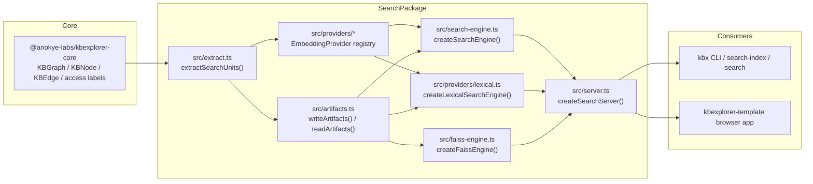

# KBX search package architecture

This repository owns the reusable search layer for the KBX graph stack. It is not the graph authoring system itself: it consumes the canonical KB graph contracts from `@anokye-labs/kbexplorer-core`, derives a searchable corpus from that graph, and serves the result set to CLI or browser consumers.

The package boundary is visible in `src/index.ts`: the public API exposes graph-compatible types, the extraction pipeline, embedding and artifact helpers, provider registration, search engines, and the local HTTP server. The runtime contract is explicit: this package does not evaluate principal access on its own; it provides a host-side filter hook and a default index-build exclusion policy.

## Package responsibility

The package is responsible for four layered jobs:

1. Convert a `KBGraph` into deterministic `SearchUnit[]` values with graph context in `src/extract.ts`.
2. Generate or reuse embeddings with `generateEmbeddings` in `src/embed.ts`, and persist canonical index artifacts in `src/artifacts.ts`.
3. Select a query engine (`createSearchEngine`, `createLexicalSearchEngine`, or `createFaissEngine`) and return `SearchResult[]` with consistent shapes across providers.
4. Serve local HTTP search through `createSearchServer` in `src/server.ts` for browser or CLI consumers.

The actual package contract is intentionally narrow: it is a reusable search companion, not a knowledge-base runtime or authorization engine.

## Dependency and ownership boundaries



This dependency graph matches the repository's declared runtime contract in `package.json`: the package depends on `@anokye-labs/kbexplorer-core` and exposes a stable library surface via `src/index.ts`, while browser and CLI tooling consume the keyed artifacts or the local HTTP endpoint rather than reimplementing search logic.

## Core contracts consumed

The canonical graph types are re-exported through `src/kbexplorer-types.ts` rather than copied locally. That file intentionally keeps a thin compatibility layer around the core package and re-exports `KBNode`, `KBEdge`, `KBGraph`, `Cluster`, `Connection`, `KBAccessLabel`, and related access types from `@anokye-labs/kbexplorer-core`.

The access policy is likewise not reinvented in isolation: `src/access.ts` imports `resolveAccessExclusion` and the access config types from `@anokye-labs/kbexplorer-core`, then re-exports them as the package's local access API. This keeps the search package aligned with the core graph/access definitions instead of drifting into a duplicate schema.

The important contracts are:

- `KBGraph` and `KBNode` from `src/kbexplorer-types.ts`
- `KBAccessLabel`, `KBAccessClassification`, and `KBAccessVisibility` from `src/kbexplorer-types.ts`
- `EmbeddingProvider` in `src/providers/interface.ts`
- `SearchUnit`, `SearchResult`, `SearchEngine`, `SearchOptions`, and `LexicalIndex` in `src/types.ts`
- `ServerConfig` and `SearchServer` in `src/server.ts`
- `GraphRankingConfig` and `RelatedSuggestion` in `src/graph-ranking.ts`

## Public API and major types

The package barrel at `src/index.ts` is the compatibility entry point. It exposes:

- Graph and access re-exports (`KBNode`, `KBEdge`, `KBGraph`, `KBAccessLabel`, etc.)
- Extraction: `extractSearchUnits`
- Access policy: `DEFAULT_ACCESS_EXCLUSION`, `resolveAccessConfig`, `isExcludedByAccess`, `classificationSeverity`
- Embedding/cache helpers: `generateEmbeddings`, `hashText`, `writeArtifacts`, `readArtifacts`, `computeContentHash`, `canonicalStringify`
- Drift validation: `checkDrift`
- Engines: `createSearchEngine`, `createLexicalSearchEngine`, `createFaissEngine`
- Provider registry: `registerProvider`, `getProvider`, `listProviders`, `OpenAIProvider`, `LexicalProvider`
- HTTP service: `createSearchServer`
- Graph ranking: `applyGraphRanking`

The most significant types are defined in `src/types.ts`:

- `SearchUnit`: the atomic unit of indexing, built from a source node and enriched with graph metadata.
- `EmbeddingVector`: a vector paired with its `unitId` and model metadata.
- `IndexMeta`: the artifact schema metadata (`version`, `contentHash`, `model`, `dimensions`, `unitCount`, `providerType`).
- `LexicalPosting` and `LexicalIndex`: the BM25 term-statistics model used for zero-credential lexical search.
- `EmbeddingArtifact`: the portable on-disk artifact set (`meta + units + vectors`).
- `SearchResult`: the consumer-facing result shape returned from search engines.
- `SearchEngine`: the uniform engine interface implemented by cosine, BM25, and FAISS-backed paths.
- `SearchOptions`: result limits, cluster/entity filtering, and the `filterUnit` host enforcement hook.

## Indexing path: from KBX graph to search artifacts

```mermaid
flowchart TD
  G[KBGraph from kbexplorer-core] --> X[extractSearchUnits() in src/extract.ts]
  X --> U[SearchUnit[]]
  U --> E[generateEmbeddings() in src/embed.ts]
  E --> V[EmbeddingVector[]]
  U --> A[writeArtifacts() / writeLexicalArtifacts() in src/artifacts.ts]
  V --> A
  A --> D[.search / units.json + vectors.json + index-meta.json]
  D --> Q[createSearchEngine / createLexicalSearchEngine / createFaissEngine]
  Q --> R[SearchResult[]]
```

`extractSearchUnits` in `src/extract.ts` is the graph-to-search translation layer. It filters the graph before building neighbor and hierarchy metadata, resolves `path` from a node's source, builds the connection map, sorts deterministically, and prepends a context header to each chunk.

The extraction logic is specifically responsible for these graph-aware values:

- `unitId` / `nodeId` / `chunkIndex`
- `title`, `cluster`, `path`, `parentId`, `entityType`, `identity`
- `connections` derived from `KBEdge[]`
- `metadata.hierarchyPath` and `metadata.neighborTitles`
- `text` that includes a `Title`, `Cluster`, `Path`, and `Related` context header before the node content

The artifact write path is deterministic by design. `src/artifacts.ts` uses `canonicalStringify` with sorted keys and stable ordering, and `computeContentHash` hashes a canonical subset of graph content so the search index can be checked for drift. `checkDrift` in `src/drift.ts` enforces that the committed artifact set matches the current graph state.

## Query path and result representation

The query layer is intentionally engine-agnostic. The engine interface is the same across modes:

- `createSearchEngine` in `src/search-engine.ts` performs brute-force cosine similarity.
- `createLexicalSearchEngine` in `src/providers/lexical.ts` builds BM25 scores from the persisted `LexicalIndex`.
- `createFaissEngine` in `src/faiss-engine.ts` optionally uses `faiss-node` for faster k-NN, but falls back to the pure-JS engine if the native dependency is unavailable.

All three return the same `SearchResult` shape, which is defined in `src/types.ts`:

- `nodeId`, `title`, `cluster`, `score`, `snippet`, `chunkIndex`, `path`, `parentId`, `identity`, `entityType`, `connections`, `metadata`
- Consumer code can therefore swap engines without changing its result handling.

`SearchOptions` carries the query-time filters:

- `limit`, `cluster`, `entityType`, `minScore`
- `filterUnit?: (unit: SearchUnit) => boolean`

This `filterUnit` hook is the boundary where the search package stops doing authz and leaves enforcement to the host. Search itself does not evaluate principals; it only checks whether a unit passes the predicate at query time.

## HTTP service and consumer contract

`src/server.ts` creates a tiny Node HTTP server for local consumption. It presents:

- `GET /health`
- `GET /stats`
- `POST /search`

The `POST /search` request body defined in `SearchRequestBody` accepts `query`, `limit`, `cluster`, `entityType`, `minScore`, and `graphRanking`. When `graphRanking` is enabled, `applyGraphRanking` in `src/graph-ranking.ts` re-ranks the result set and returns `suggestions` derived from graph structure rather than raw embedding similarity.

This is the main compatibility boundary between the package and its consumers: the host can call the library API directly or use the HTTP service, but it should not expect the package to know which user or principal is making the request.

## Provider and extension boundaries

The extension boundary is `EmbeddingProvider` in `src/providers/interface.ts`. A provider must expose:

- `name`
- `dimensions`
- `model`
- `embed(texts: string[]): Promise<number[][]>`

The registry in `src/providers/registry.ts` allows name-based resolution through `registerProvider`, `getProvider`, and `listProviders`. The default provider is the OpenAI implementation in `src/providers/openai.ts`; the zero-credential lexical index is registered in `src/providers/lexical.ts` and intentionally throws from `embed()` because BM25 requires corpus-wide stats that a per-call embedding cannot carry.

This means the package can support multiple backends without hardcoding one API. The same typed artifact contract (`EmbeddingArtifact`, `SearchUnit`, `SearchResult`) is used across embedding and lexical modes.

## Limits and deliberately supported behavior

The package documents and enforces several limits explicitly in code:

- `LexicalProvider.embed()` intentionally throws because BM25 needs whole-corpus term statistics; the production path is `buildLexicalIndex` + `createLexicalSearchEngine`.
- `createFaissEngine` is optional acceleration only. `faiss-node` is an `optionalDependency` in `package.json`, and the engine falls back to the pure JavaScript implementation when the native dependency is missing or incompatible.
- `src/access.ts` treats custom or unknown classification and visibility values as fail-closed. If a label token is not recognized by the built-in lattice, it is withheld rather than silently indexed.
- `SearchOptions.filterUnit` is a host predicate, not a built-in auth implementation. The package performs no principal evaluation.
- `createSearchServer` only accepts a static `filterUnit` at server creation time, because JSON requests cannot carry functions.
- `applyGraphRanking` filters its neighbor / suggestion graphs with the same `filterUnit` set used for the results it re-ranks, preventing access-filtered nodes from leaking into suggestions.
- Artifact serialization stays deterministic (`canonicalStringify`, sorted keys, stable arrays, trailing newline) to satisfy deterministic drift checks and avoid non-repeatable index builds.

## Practical package summary

In short, this repository is the reusable, graph-aware search engine for KBX:

- the graph is authored and modeled elsewhere (`kbexplorer-core`)
- this package extracts search units from that graph
- it persists deterministic artifact sets from the extracted units
- it serves those artifacts via multiple compatible engines and a local HTTP API
- it leaves the final principal-enforcement decision to the host that consumes the results

`src/index.ts` is the stable contract boundary for consumers. `src/extract.ts`, `src/artifacts.ts`, `src/providers/*`, and `src/server.ts` are the implementation surfaces that realize it.
